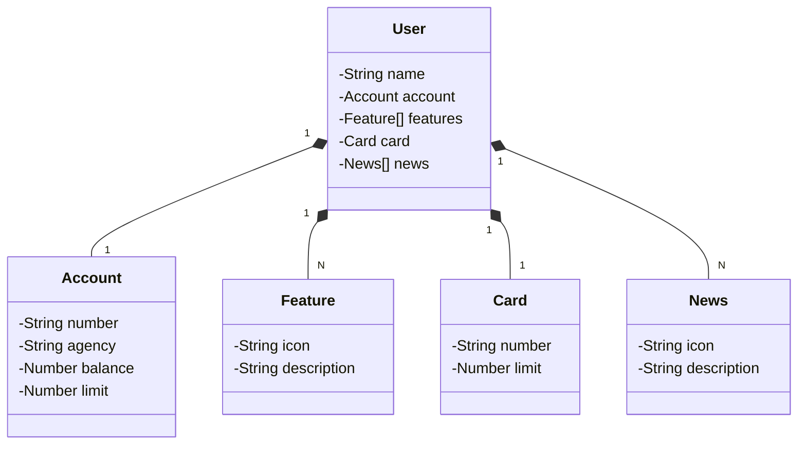

# Criando uma RESTful API com Java 17, Spring Boot 3 e Railway
Java RESTful API criado para estudos, na Santander Dev Week.

## Diagrama de classes 

---
# Link do Deploy:
https://sdw-2023-api-prd-luis.up.railway.app/swagger-ui/index.html
